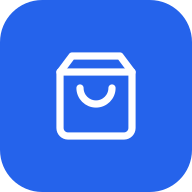

<div align="center">



# VendasApp

**Sistema de gestão de vendas e PDV instalável como PWA, construído com Next.js 16 + Supabase.**

[](https://github.com/MatheusBrazolin/vendas-app/actions/workflows/ci.yml)
[](https://vendas-app-topaz.vercel.app)
[](https://nextjs.org/)
[](https://supabase.com/)
[](LICENSE)

</div>

---

PDV de balcão para pequenos comércios: leitor USB de código de barras, baixa automática de estoque, cálculo de troco, cadastro de produtos via APIs de barcode públicas com cache permanente e controle de papéis (admin × funcionário). Funciona **offline-first** — registra vendas mesmo sem internet e sincroniza ao reconectar — e pode rodar como **PWA** no navegador/celular ou como **app desktop instalável** no Windows.

## Índice

- [Funcionalidades](#-funcionalidades)
- [Stack](#-stack)
- [Rodando localmente](#-rodando-localmente)
- [Deploy](#-deploy)
- [App Desktop (Windows)](#-app-desktop-windows)
- [Relatório diário por email](#-relatório-diário-por-email)
- [Como o offline funciona](#-como-o-offline-funciona)
- [Estrutura](#-estrutura)
- [Testes](#-testes)
- [Cache de código de barras](#-cache-de-código-de-barras)
- [Segurança](#-segurança)
- [Roadmap](#-roadmap)
- [Licença](#-licença)

## ✨ Funcionalidades

- **PDV (Ponto de Venda)** com leitor USB, busca inteligente por nome ou código, carrinho com ajuste de quantidade, métodos de pagamento (Dinheiro, PIX, Crédito, Débito) e **calculadora de troco** automática quando o pagamento é em dinheiro.
- **Cadastro de produtos** com auto-preenchimento via código de barras: ao escanear um EAN/UPC, busca nome e descrição em [Cosmos (Bluesoft)](https://cosmos.bluesoft.com.br/), [Open Food Facts](https://world.openfoodfacts.org/) e [UPCitemdb](https://www.upcitemdb.com/) — com **cache permanente** que garante que cada código consome no máximo uma consulta de API na vida toda.
- **Controle de papéis** via tabela `user_roles`: `admin` (acesso total ao Dashboard, Produtos, Categorias, Usuários, cancelamento de vendas) e `employee` (apenas o PDV e as vendas **do dia** — sem acesso ao histórico completo nem a relatórios antigos). A trava é feita no servidor, então não dá para burlar pela URL.
- **Cancelamento de venda** restrito a admins, com restauração atômica de estoque via função Postgres.
- **Baixa automática de estoque** ao confirmar a venda, com bloqueio se o estoque ficar negativo.
- **Dashboard** com KPIs, gráfico de vendas, top produtos, últimas vendas e alerta de produtos com estoque baixo.
- **Funciona offline (offline-first)** — o catálogo é cacheado em IndexedDB e o PDV registra vendas mesmo sem internet, guardando-as numa fila local. Ao reconectar, as vendas são reenviadas ao servidor de forma **idempotente** (chave `client_uuid`), e conflitos de estoque viram vendas "rejeitadas" para revisão manual. Um **indicador vermelho** aparece no canto quando a conexão cai.
- **Recibo térmico (80mm)** — impressão do recibo da venda direto pela página do recibo (online) e também **offline**, a partir do carrinho, com marca de "provisório" até a venda sincronizar.
- **Relatório diário de fechamento por email** — todo dia, em horário fixo, um resumo do caixa (total, ticket médio, quebra por forma de pagamento) é enviado por email aos administradores. Os destinatários são gerenciáveis por uma tela admin.
- **PWA instalável** — manifesto + Service Worker permitem instalar o app no PC ou celular, com ícone próprio, janela standalone e atalho na área de trabalho.
- **App desktop para Windows** — instalador `.exe` (Electron) para o caixa ter um funcionamento fixo que resiste a quedas de internet. Baixável por uma página admin no próprio site.
- **Autenticação** via Supabase Auth com **RLS** habilitado em todas as tabelas e middleware Next.js validando a sessão server-side.
- **Layout responsivo** com sidebar fixa no desktop e drawer hambúrguer no mobile.

## 🛠️ Stack

| Camada | Tecnologia |
|---|---|
| Framework | [Next.js 16](https://nextjs.org/) (App Router, Server Components, Server Actions, Turbopack) |
| Linguagem | TypeScript |
| UI | [Base UI](https://base-ui.com/) + Tailwind CSS v4 |
| Banco e Auth | [Supabase](https://supabase.com/) (PostgreSQL + Auth + RLS), região `sa-east-1` (São Paulo) |
| Hospedagem | [Vercel](https://vercel.com) (Hobby), funções em `gru1` (São Paulo) |
| Validação | [Zod](https://zod.dev/) v4 |
| Formulários | React Hook Form |
| Gráficos | Recharts |
| Toasts | Sonner |
| Ícones | Lucide React |
| PWA | Manifest API do Next.js + Service Worker próprio em `public/sw.js` |
| Offline | [Dexie](https://dexie.org/) (IndexedDB) — cache de leitura + fila de vendas |
| Desktop | [Electron](https://www.electronjs.org/) + electron-builder (instalador NSIS) |
| Email | [Nodemailer](https://nodemailer.com/) (SMTP) + [Vercel Cron](https://vercel.com/docs/cron-jobs) (relatório diário) |
| Testes | [Vitest](https://vitest.dev/) + Testing Library + fake-indexeddb |
| CI | GitHub Actions (typecheck + testes + build a cada push) |

## 🚀 Rodando localmente

### Pré-requisitos

- Node.js 20+
- Conta no [Supabase](https://supabase.com/) (free tier funciona; crie o projeto em **South America (São Paulo)** para latência baixa)
- Opcional: token gratuito do [Cosmos Bluesoft](https://cosmos.bluesoft.com.br/) para lookup de produtos brasileiros

### Setup

```bash
git clone https://github.com/MatheusBrazolin/vendas-app.git
cd vendas-app
npm install
cp .env.example .env.local      # edite com seus valores
npm run dev                     # http://localhost:3000
```

### Variáveis de ambiente

```env
NEXT_PUBLIC_SUPABASE_URL=https://seuprojeto.supabase.co
NEXT_PUBLIC_SUPABASE_ANON_KEY=eyJhbGc...
SUPABASE_SERVICE_ROLE_KEY=eyJhbGc...
COSMOS_API_TOKEN=               # opcional

# Relatório diário por email (opcional — só se quiser o envio automático)
CRON_SECRET=                    # segredo que protege a rota do cron
SMTP_HOST=smtp.gmail.com
SMTP_PORT=465
SMTP_USER=seuemail@gmail.com
SMTP_PASS=                      # senha de app (Gmail), não a senha normal
SMTP_FROM=VendasApp <seuemail@gmail.com>
REPORT_EMAIL=                   # destinatário(s) garantido(s), separados por vírgula
```

### Migrations do banco

No painel do Supabase, abra o **SQL Editor** e execute na ordem cronológica (prefixo do nome do arquivo):

```
supabase/migrations/
├── 001_initial_schema.sql              tabelas core + RPC create_sale_with_items
├── 20260525000000_barcode_cache.sql    cache de lookups de barcode
├── 20260526000000_user_roles.sql       roles admin/employee + trigger de signup
├── 20260527000000_profiles.sql         nomes/avatar dos usuários
├── 20260528000000_cancel_sale.sql      RPC de cancelamento atômico
├── 20260603000000_offline_sales.sql    client_uuid + RPC idempotente (vendas offline)
└── 20260609000000_report_recipients.sql  destinatários do relatório por email (admin)
```

## 🌐 Deploy

O app está em produção em **[vendas-app-topaz.vercel.app](https://vendas-app-topaz.vercel.app)**. A configuração da Vercel está em [`vercel.json`](vercel.json) — funções serverless rodam em `gru1` (São Paulo) para manter latência baixa quando combinado com Supabase em `sa-east-1`.

Para deployar a sua própria cópia:

1. Fork o repo
2. `vercel.com/new` → import → selecione seu fork
3. Em **Environment Variables**, adicione `NEXT_PUBLIC_SUPABASE_URL`, `NEXT_PUBLIC_SUPABASE_ANON_KEY` e `SUPABASE_SERVICE_ROLE_KEY` (opcionalmente as variáveis de email — ver [Relatório diário por email](#-relatório-diário-por-email))
4. Deploy

## 💻 App Desktop (Windows)

Além do acesso pelo navegador (que o dono usa no **celular** para acompanhar as
vendas), há um **app instalável para Windows** — ideal para o caixa/PDV ter um
funcionamento fixo que continua operando se a internet cair.

É um shell Electron ([`electron/main.cjs`](electron/main.cjs)) que abre a versão
publicada numa janela própria. Como o Electron embute o Chromium, o **service
worker e o cache offline** (IndexedDB) funcionam igual ao Chrome: após o primeiro
acesso online (necessário para logar e cachear), o app continua funcionando sem
internet, com as vendas enfileiradas localmente e sincronizadas ao reconectar.

```bash
# Rodar o app desktop em modo dev (abre uma janela; aponta para produção)
npm run desktop

# Apontar para um servidor local durante o desenvolvimento
# (PowerShell)  $env:VENDAS_APP_URL="http://localhost:3000"; npm run desktop

# Gerar o instalador → pasta instalador/VendasApp-Instalador.exe
npm run desktop:build
```

O `npm run desktop:build` cria a pasta **`instalador/`** na raiz do projeto. É ali
que fica o arquivo de instalação: **`instalador/VendasApp-Instalador.exe`**.
Esse `.exe` é autocontido — copie-o para qualquer PC Windows e dê duplo-clique para
instalar (não precisa de Node nem nada). A pasta `instalador/` é ignorada pelo git.

### Disponibilizar o download no site (admin)

Há uma página **admin** em **`/configuracoes/baixar`** (no menu "Administração")
com o botão de baixar — visível só para administradores e oculta dentro do próprio
app desktop. Ela aponta para o instalador hospedado no **GitHub Releases**:

1. Gere o `.exe` (`npm run desktop:build`).
2. No GitHub, crie um **Release** no repo e suba `instalador/VendasApp-Instalador.exe`
   como *asset* (mantenha exatamente esse nome).
3. Pronto — o botão usa a URL estável de "último release":
   `…/releases/latest/download/VendasApp-Instalador.exe`. A cada novo release com o
   mesmo nome de arquivo, o botão passa a baixar a versão nova sem mexer no código.

Para hospedar o `.exe` em outro lugar, defina `NEXT_PUBLIC_DESKTOP_DOWNLOAD_URL`.

> **Login offline:** a autenticação é do Supabase e exige rede. O cenário coberto é
> "estava logado e a internet caiu" — aí tudo continua funcionando. Um *cold start*
> totalmente offline (app fechado + sem rede + sessão expirada) exigiria login, que
> não funciona sem conexão.

> **Build no Windows — erro de symlink:** o `electron-builder` extrai a ferramenta
> `winCodeSign`, que contém symlinks de macOS e falha sem privilégio
> (`Cannot create symbolic link`). Soluções: ativar o **Modo de Desenvolvedor** do
> Windows *(Configurações → Privacidade e segurança → Para desenvolvedores)* **ou**
> rodar o terminal como **Administrador**, e então `npm run desktop:build`. O
> instalador gerado é **não-assinado** (o SmartScreen mostra um aviso na 1ª execução
> → "Mais informações" → "Executar assim mesmo").

## 📧 Relatório diário por email

Todo dia, às **20h (horário de Brasília)**, o sistema envia por email um **resumo do fechamento de caixa** do dia — total, número de vendas, ticket médio e quebra por forma de pagamento.

Como funciona:

- Um **Vercel Cron** (configurado em [`vercel.json`](vercel.json) — `0 23 * * *` UTC = 20h BRT) chama a rota protegida [`/api/cron/daily-cash-close`](src/app/api/cron/daily-cash-close/route.ts).
- A rota só roda com o header `Authorization: Bearer $CRON_SECRET` (a Vercel envia automaticamente). Sem o segredo → 401.
- O resumo é montado pela mesma query do "Fechar caixa" (via service-role, sem sessão de usuário) e o email é enviado por **SMTP** (Nodemailer).

**Quem recebe** é a união de três fontes (deduplicadas, ignorando emails internos `@vendas-app.interno`):

1. Administradores cujo login é um **email real**;
2. A env `REPORT_EMAIL` (um ou vários, separados por vírgula);
3. Emails ativos cadastrados na tela admin **`/configuracoes/relatorio`**.

A tela de destinatários permite adicionar, ativar/desativar e remover endereços — útil quando há **mais de um admin** ou quando se quer mandar para o contador, por exemplo. Contas criadas no app logam por usuário (sem caixa de entrada real), por isso o `REPORT_EMAIL` garante a entrega ao dono.

> **Configuração:** defina `CRON_SECRET`, as variáveis `SMTP_*` e `REPORT_EMAIL` no ambiente (local em `.env.local`, produção nas *Environment Variables* da Vercel). Para Gmail, use uma **senha de app** (não a senha normal).

## 🔌 Como o offline funciona

O servidor (Supabase) é sempre a fonte da verdade; o offline é **otimista** e reconcilia ao reconectar.

```
LEITURA                          ESCRITA (venda)
SyncProvider sincroniza          Online?
products/categorias para         ├─ sim → cria no servidor (RPC)
IndexedDB (Dexie) em cada        │         └─ falha de rede → cai p/ fila
reconexão / foco.                └─ não → grava na fila local (IndexedDB)
PDV lê do cache local →                    e baixa o estoque local (otimista)
funciona com ou sem internet.
                                 Ao reconectar, flushPendingSales():
                                 • reenvia cada venda com seu client_uuid
                                   (idempotente — reenvio nunca duplica)
                                 • sucesso → remove da fila + re-sincroniza estoque
                                 • estoque insuficiente → marca "rejeitada"
                                   p/ revisão manual (não descarta nem repete)
```

Decisões-chave:

- **Idempotência:** cada venda carrega um `client_uuid` único; a RPC `create_sale_with_items` devolve a venda existente se o UUID já foi gravado, então um reenvio após falha parcial nunca cria duplicata.
- **Conflito de estoque entre dispositivos:** como o offline é otimista, dois caixas podem vender o mesmo item sem rede. O servidor rejeita o segundo na sincronização (`insufficient_stock`) e a venda vira `rejeitada` para o admin resolver — em vez de furar o estoque silenciosamente.
- **Limite conhecido:** *login* exige rede (é o Supabase Auth). O cenário coberto é "estava logado e a internet caiu".

## 📂 Estrutura

```
src/
├── app/
│   ├── (auth)/             /login, recuperação de senha (cadastro público desativado)
│   ├── (dashboard)/        área autenticada
│   │   ├── dashboard/      KPIs e visão geral (admin)
│   │   ├── produtos/       CRUD de produtos e categorias (admin)
│   │   ├── vendas/         PDV em /nova, histórico (do dia p/ funcionário), recibo, cancelamento
│   │   ├── configuracoes/  usuários + baixar app + destinatários do relatório (admin)
│   │   └── layout.tsx
│   ├── api/cron/           rota do relatório diário (Vercel Cron)
│   ├── manifest.ts         PWA manifest
│   └── layout.tsx          root, fontes, toaster, registro do SW
├── components/
│   ├── dashboard/          widgets de KPI/gráfico/alertas
│   ├── layout/             sidebar (desktop + mobile drawer), header, breadcrumb
│   ├── products/           formulário com auto-preenchimento por barcode
│   ├── sales/              busca de produto no PDV, carrinho, cancelar venda
│   ├── pwa/                SW register, botão instalar, indicador offline,
│   │                        sync provider, badge de vendas pendentes
│   └── ui/                 primitivos de UI (Base UI)
├── hooks/                  React hooks (use-debounce)
├── lib/
│   ├── auth/roles.ts       getCurrentUser, requireAdmin, etc.
│   ├── barcode/lookup.ts   Cosmos → Open Food Facts → UPCitemdb + cache
│   ├── email/              mailer SMTP, builder do relatório, resolução de destinatários
│   ├── offline/            cache IndexedDB (Dexie), sync, fila de vendas offline
│   ├── queries/            consultas tipadas ao Supabase
│   ├── supabase/           clients de server/client/middleware
│   ├── utils/              format, datetime (BRT), receipt, print-receipt (recibo offline)
│   └── validations/        schemas Zod
└── types/database.ts       tipos gerados a partir do schema
electron/
├── main.cjs                shell desktop (Windows) que abre o app publicado
└── icon.png                ícone do instalador
public/
├── icon-*.png              ícones do PWA (gerados por scripts/generate-pwa-icons.mjs)
├── sw.js                   Service Worker
└── icon-source.svg         SVG-fonte dos ícones
scripts/
└── generate-pwa-icons.mjs  gera os PNGs do PWA a partir do SVG-fonte
```

## 🧪 Testes

Testes unitários com **Vitest** (+ jsdom e `fake-indexeddb` para a camada offline).
Os testes ficam ao lado do código que cobrem (`*.test.ts`).

```bash
npm test              # roda toda a suíte uma vez
npm run test:watch    # modo watch durante o desenvolvimento
npm run test:coverage # relatório de cobertura
```

A prioridade é a **lógica de risco**, não cobrir tudo às cegas:

| Área | O que é verificado |
|------|--------------------|
| `lib/validations` | Schemas Zod (login, funcionário, produto, categoria) — 100% |
| `lib/offline/sales-repo` | Fila offline: baixa otimista de estoque, idempotência (`client_uuid`), erro terminal × transitório, guarda offline |
| `lib/offline/products-repo` | Busca offline por nome/código, filtro de inativos/sem estoque |
| `vendas/actions` | `createSale`: mapeamento de erros do servidor para mensagem + código |
| `lib/utils/format` | Moeda (BRL), datas, rótulos de pagamento |
| `lib/utils/print-receipt` | Recibo 80mm: conteúdo, marca "provisório", escape de HTML |
| `lib/email/cash-close-email` | Assunto/HTML/texto do relatório; singular/plural; dia vazio |
| `lib/email/report-recipients` | Merge das 3 fontes de destinatários, dedupe, filtro de internos |

UI e *waterfalls* de dados ficam para testes E2E (Playwright) numa etapa futura.

## 🧠 Cache de código de barras

```
[1] Já está em products?              → toast "Já cadastrado"
       ↓ não
[2] Já está em barcode_cache?         → reusa, ZERO consultas externas
       ↓ não
[3] Cosmos → Open Food Facts → UPCitemdb
       ↓
[4] Grava em barcode_cache            → próxima vez é instantânea
```

## 🔐 Segurança

- `.env*` e a pasta `.claude/` no `.gitignore` — segredos e configs de ferramenta nunca sobem ao repositório.
- **RLS habilitado** em `products`, `categories`, `sales`, `sale_items`, `user_roles`, `profiles`, `barcode_cache`.
- O layout autenticado valida a sessão no server (`getCurrentUser()`) e redireciona para `/login` antes de qualquer render; páginas admin reforçam com `requireAdmin()`.
- Cancelamento de venda é admin-only no Node **e** na função Postgres (defense in depth — a RPC levanta 42501 se `is_admin()` for falso).
- Headers do Service Worker pinados em `next.config.ts` (`Content-Type` correto + `no-cache` para garantir propagação de versões novas).

## 🗺️ Roadmap

- [x] PDV com carrinho, métodos de pagamento, validação de campos obrigatórios e calculadora de troco
- [x] Cancelamento de venda admin-only com restauração atômica de estoque
- [x] Sidebar responsiva (drawer no mobile)
- [x] **PWA Fase 1** — instalável no Chrome/Edge/Safari + botão "Instalar app"
- [x] **PWA Fase 2** — cache de produtos em IndexedDB, leitura offline no PDV
- [x] **PWA Fase 3** — fila de vendas offline + replay idempotente + conflito de estoque
- [x] **App desktop Windows** — instalável (.exe) via Electron, com offline
- [x] **Testes unitários** da lógica crítica (Vitest): fila offline, schemas, createSale
- [x] **Recibo térmico (80mm)** imprimível online e offline (recibo provisório)
- [x] **Histórico restrito ao dia** para funcionário (trava no servidor)
- [x] **Relatório diário de fechamento por email** (Vercel Cron + SMTP) com tela admin de destinatários
- [ ] Testes E2E (Playwright) do fluxo de venda offline
- [ ] Emissão de NFC-e via serviço terceirizado
- [ ] Relatórios exportáveis (CSV/PDF)
- [ ] Login offline (sessão em cache) para *cold start* sem internet

## 📜 Licença

[MIT](LICENSE)
